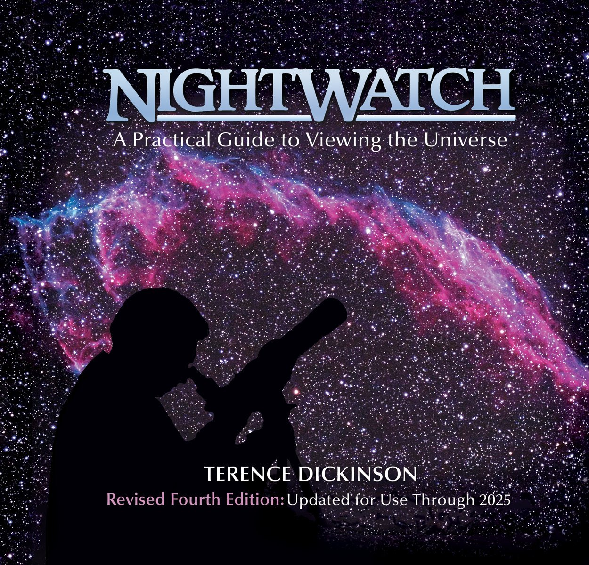
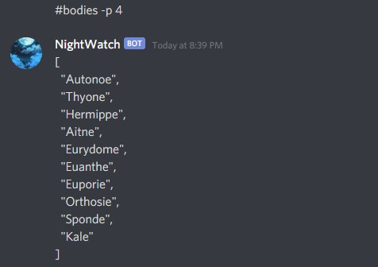
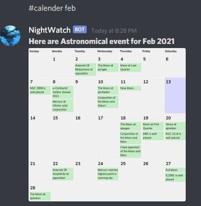
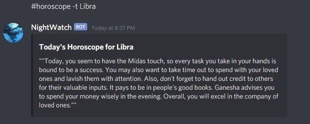
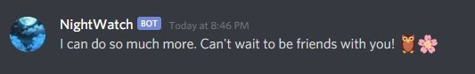
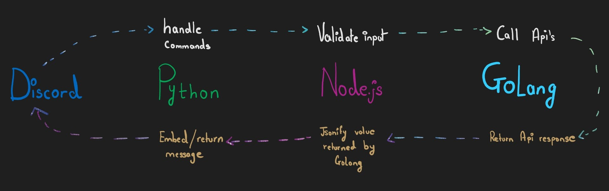

<div align="center"><h1>NightWatch</h1></div>
<div align="center"><h3>Discord bot built to be your companion under starry night</h3></div>


<pre><div align="center">         </div></pre> 

# Table of Content:
- [Features](#features)
- [Abiding by the theme](#abiding-by-the-theme)
- [Display Shots](#display-shots)
- [Adding the bot](#adding-the-bot)
- [Running the project](#running-the-project)
- [Rube goldberg implementation](#rube-goldberg-implementation)
- [API used](#api-used)
- [Contact info](#contact-info)
- [Member List](#member-list)

## Features
- ✅ Get names of Solar system bodies
- ✅ Get Data on a specific body
- ✅ Get Astronomical calender
- ✅ Get Horoscope based on sun sign
- ✅ Give options to get today's horoscope or month horoscope for a sun sign.
- ✅ Script to know when it will be dark enough to see the stars
- 🚧 Get closed star gazing spots given a location.
- 🚧 Get info about main meteor showers in recent future.

## Abiding by the theme
<h4>Since the theme of this hackathon required us to base the name of the product on a book, I chose <b>NightWatch: A Practical Guide to Viewing the Universe. </b>NightWatch has been acclaimed as the best general interest introduction to astronomy.  </h4>
<div align="center"></div>

## Display Shots

<div align="center"></div><br/>
 <div align="center">  </div> <br/>  <div align="center">     </div><br/> <div align="center">  </div> <br/>

## Adding the bot
Dont wanna run the project and just wanna get to using the bot? I gotchu.
```
https://discord.com/api/oauth2/authorize?client_id=798667265418854460&permissions=1814559824&scope=bot
```

## Running the project
The project is setup in such a way that you can run it using bunch of repl's. No need to download anything on your device !
```
Link to replit : https://repl.it/
```

### Discord bot (Python)
- Fork this repl : https://repl.it/@GottaCatchEmAll/montainPythonRepl#main.py
- Make discord developer account and make a bot [https://discord.com/developers/docs/game-sdk/applications]
- Add bot token in .env file
- Update all url's to fit your username and node.js replit name


### Node.js
- Fork this repl : https://repl.it/@GottaCatchEmAll/montainNodeRepl#index.js
- Update the url's to fit your username and node.js replit name


### Golang
- Fork this repl : https://repl.it/@GottaCatchEmAll/mountainGoRepl#main.go
- This repl can be used as a rest API. You can make frontend with anything and hit these endpoints to make an application.

<b>NOTE:</b>For all the files please update the url used to hit endpoints accordingly.

## Rube goldberg implementation
Rube goldberg implementation means accomplishing by complex means what seemingly could be done simply. Usually discord bots need only one server but this project has three in total. What's more is that each of these server's are implemented in 3 different languages namely python, node.js and golang ! Here's how they work together
- Python server will do discord.py specific funuctions. 
- Requests are forwared to Node.js server for validating inputs. For example checking if month name is correct or page number is valid.
- Any requests which need api calls are forwarded to Golang server after validating input through node.js server.  
- Results are then returned from golang server to node.js to python to discord server. Beautiful !

<div align="center"></div><br/>

## API used
- https://github.com/tapaswenipathak/Horoscope-API
- https://api.le-systeme-solaire.net/en/
- https://rhodesmill.org/skyfield/
- https://in-the-sky.org/newscal.php?year=2021&month=8&maxdiff=7


## Contact info
```
avichare@sfu.ca
```

## Member List
```
Me, myself and I 🎈
```

